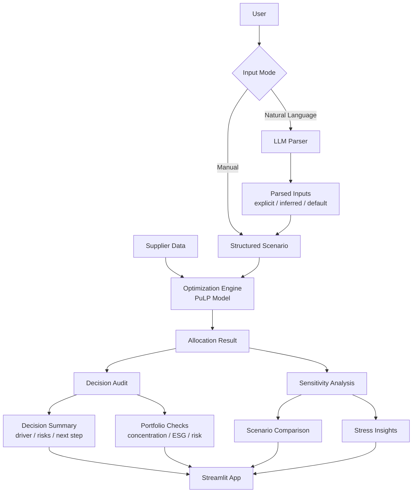

# AI-Assisted Sourcing Decision Copilot

This project explores how sourcing optimization systems can be extended with a decision-intelligence layer that improves transparency and usability.

Platforms like Keelvar’s Kai focus on running and optimizing sourcing events. This project looks at the next layer, helping users understand, review, and stress-test those decisions more effectively.

Instead of only generating an optimal allocation, the system helps answer questions like:
- Why did the model choose these suppliers?
- Is the solution too concentrated?
- What happens if constraints change?
- Are we close to violating ESG or risk limits?

The goal is not to replace optimization systems, but to complement them with better visibility and decision support.

Live App Link: https://ai-sourcing-decision-copilot-dcdbvsu66ge24i7uvb3d5c.streamlit.app/

## What this project does

Given a sourcing scenario, the system:

- allocates demand across suppliers using an optimization model  
- explains the outcome in simple business terms  
- highlights risks like concentration or tight constraints  
- tests how stable the decision is under different scenarios  
- allows users to describe sourcing needs in plain English  

The focus is not just on getting an answer, but on understanding the decision behind it.

## How it works (simple view)

The system has four main parts:

**Optimization**  
A linear model decides how to allocate demand while respecting constraints like capacity, ESG, risk, supplier share, and minimum supplier count.

**Decision Audit**  
The output is translated into a simple explanation: what drove the decision, where the risks are, and what to look at next.

**Sensitivity Analysis**  
The model is re-run under different conditions (like stricter ESG or higher demand) to see how robust the solution is.

**Natural Language Input (LLM)**  
Users can describe a scenario in plain English. The LLM converts this into structured inputs, but does not make decisions.

## Why this approach

In sourcing, decisions need to be explainable and controllable.

Instead of using AI to directly make decisions, this system separates roles clearly:
- the model makes the decision  
- the audit explains it  
- the user stays in control  
- the AI only helps structure input  

This keeps the system transparent and avoids black-box behavior.

## Where this fits in practice

This system fits alongside sourcing workflows where teams already use optimization, but need more clarity on the outcomes.

For example:
- after running an optimized sourcing event, understanding why certain suppliers were selected  
- checking if the allocation is too dependent on a few suppliers  
- testing whether a stricter ESG or risk requirement would break the solution  
- turning a business request into a structured scenario quickly  

It helps shift the focus from *“what is the optimal answer?”* to *“do we trust and understand this answer?”*

## Architecture

